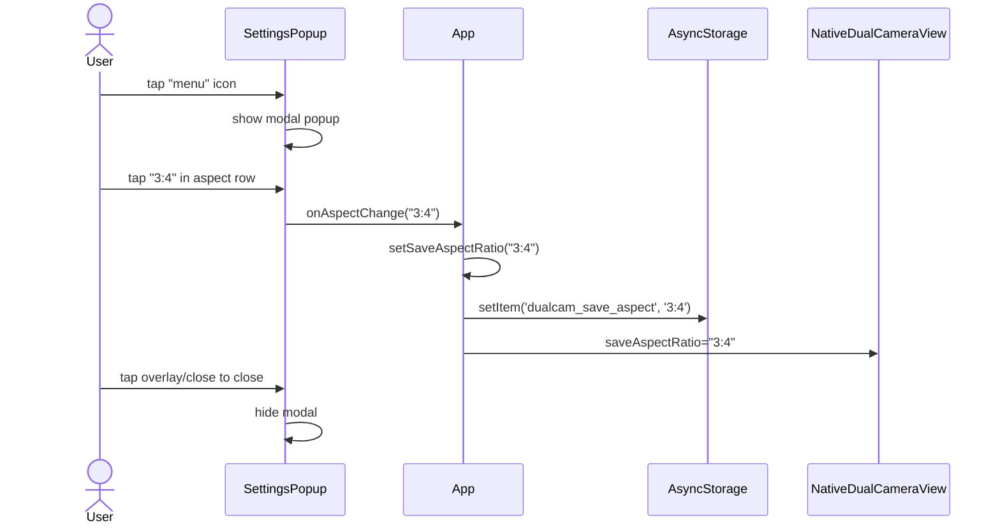
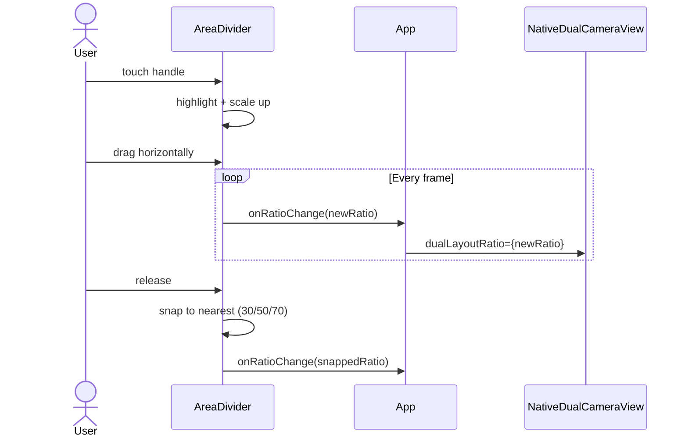
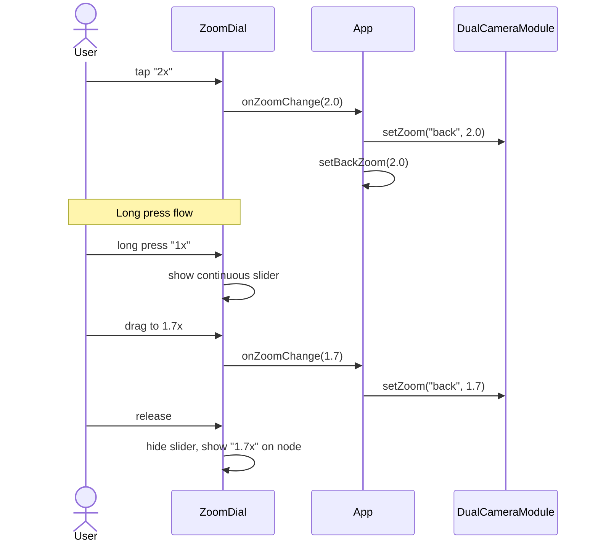

# UI Redesign Spec — 双摄相机

> **Status**: Draft
> **Author**: System Architect
> **Created**: 2026-05-07

---

## 1. 需求分析

用户提出三项核心改造需求：

| # | 需求 | 现状 | 目标 |
|---|------|------|------|
| 1 | 顶栏比例菜单 | 左上角 3 个比例按钮平铺 (`9:16` `3:4` `1:1`) | 改为通用设置弹窗（三横或六点图标等），当前仅放入比例选择，为未来扩展（滤镜、调整等）留出空间 |
| 2 | 区域大小调整 | 独立的"调整"浮动按钮 + 弹出调整面板 | 去掉按钮和面板，改为**分隔条拖拽**（上下/左右箭头可视化） |
| 3 | 焦距调整 | 全局统一的 zoom bar，LR/SX 需切换目标 | 每个摄像头区域**各自独立**拥有焦距控件，后置 5 档，前置 2 档，长按可滑动连续调焦 |

---

## 2. 竞品调研

### 2.1 iPhone 原生相机

```
┌─────────────────────────────┐
│  ˅  (chevron/折叠菜单)       │  ← 顶栏，点击展开设置行
│                             │
│                             │
│    [  Camera Preview  ]     │
│                             │
│                             │
│      ◯.5 ●1 ◯2 ◯3 ◯5      │  ← 焦距拨盘 (zoom dial)
│                             │
│   [Photo] [Video] [...]     │  ← 模式切换
│        ⊙ (Shutter)          │  ← 快门
└─────────────────────────────┘
```

**关键 UI 模式**：
- **Chevron 折叠菜单**：顶部中央一个 `˅` 箭头，轻触后向下展开一行工具栏（闪光灯、夜景、比例、定时器等）
- **比例选择**：在展开行中，比例图标显示当前值 `4:3`，点击循环切换（4:3 → 16:9 → 1:1）
- **Zoom Dial（焦距拨盘）**：
  - 后置默认显示 5 个圆形节点（`.5x` `1x` `2x` `3x` `5x`），当前选中高亮为黄色
  - **长按**任意节点 → 弹出弧形/线性连续滑动刻度盘，可精细调整 0.1 步进
  - 松手后回到节点显示，选中最近的标称值

### 2.2 DoubleTake (FiLMiC Pro)

- **Split-Screen 模式**：50/50 分割，中间有细线分隔
- **Camera Picker**：底部左侧独立入口选择镜头组合
- **每个区域独立对焦/曝光**：各半区有独立对焦框
- **PiP 模式**：小窗可拖拽移动、可 swipe off-screen
- **不支持拖拽分隔条调整比例**（固定 50/50）

### 2.3 通用分屏调整模式（Material / iOS 多任务）

| 特征 | 推荐做法 |
|------|----------|
| 分隔条 Handle | Pill 形状居中，内含方向箭头 `‹ ›` 或 `▲ ▼` |
| 触摸热区 | 最少 44×44dp，大于可视宽度 |
| 吸附点 | 30/70、50/50、70/30 三档吸附 |
| 反馈 | 触摸时 Handle 放大 + 颜色变亮 |
| 极值限制 | 任一侧不低于 20% |

---

## 3. 设计方案

### 3.1 顶栏设置弹窗 (SettingsPopup)

**架构**：

```
┌──────────────────────────────────────────────┐
│ [≡]                            [录制指示器]   │  ← 折叠态 (三横或六点图标)
└──────────────────────────────────────────────┘

点击 [≡] 弹出居中或顶部悬浮面板 ↓

┌──────────────────────────────────────────────┐
│                                              │
│      ┌────────────────────────────────┐      │
│      │ [设置]                         │      │
│      │                                │      │
│      │ 画面比例   [9:16] [3:4] [1:1]  │      │
│      │ (预留功能: 画面调整、滤镜等...)│      │
│      └────────────────────────────────┘      │
│                                              │
└──────────────────────────────────────────────┘
```

**组件设计**：

```jsx
// New component: SettingsPopup
function SettingsPopup({
  visible,             // boolean
  onClose,             // () => void
  onOpen,              // () => void
  aspectRatio,         // '9:16' | '3:4' | '1:1'
  onAspectChange,      // (ratio: string) => void
  disabled,            // boolean (recording state)
}) { ... }
```

**行为逻辑**：
- 默认态：左上角显示一个通用设置图标（如三横 `≡` 或六点矩阵 `⠿`），保持顶栏清爽。
- 点击后展开：屏幕居中或顶部往下悬浮弹出一个带有半透明蒙层（Overlay）的弹窗（Modal/Popup）。
- 弹窗内容：包含一行“画面比例”设置，排布 3 个比例按钮，高亮当前选中项。
- 交互：在弹窗内选中比例后，弹窗**不自动关闭**，方便用户继续调整未来添加的其他选项。点击蒙层空白处或专门的关闭按钮收起。
- 录制中 `disabled=true`，图标灰度不可交互。

**替代的内容**：
- 删除现有 `aspectPickerContainer` 和关联的 3 个 `aspectBtn`（L552-567）
- 删除 `adjustToggleBtn`（L570-574）

### 3.2 区域分隔条 (AreaDivider)

**仅在 LR 和 SX 模式下渲染**。

```
LR（左右分割）模式:               SX（上下分割）模式:

┌─────────┬──┬─────────┐      ┌──────────────────┐
│         │⟨⟩│         │      │                  │
│  Back   │⇐⇒│  Front  │      │     Back/Top     │
│         │⟨⟩│         │      │                  │
└─────────┴──┴─────────┘      ├──────▲▼──────────┤
                               │                  │
                               │   Front/Bottom   │
                               │                  │
                               └──────────────────┘
```

**组件设计**：

```jsx
// New component: AreaDivider
function AreaDivider({
  mode,                 // 'lr' | 'sx'
  ratio,                // number (0.2 ~ 0.8)
  onRatioChange,        // (newRatio: number) => void
  screenWidth,          // number
  screenHeight,         // number
  disabled,             // boolean (recording state)
}) { ... }
```

**交互行为**：
- **可视元素**：分隔线中央有一个 pill 形状的 handle（36×20 或 20×36），内含方向箭头
  - LR 模式: `◀ ▶` 水平箭头
  - SX 模式: `▲ ▼` 垂直箭头
- **拖拽**：使用 `PanResponder` 响应拖拽手势，实时更新 `dualLayoutRatio`
- **吸附**：拖拽释放时，若接近 30%/50%/70% 则吸附
- **触觉反馈**：在吸附点触发 `Haptics.impactAsync()`（需要 `expo-haptics`）
- **极值**：ratio 限制在 `[0.2, 0.8]` 范围
- **拖拽反馈**：触摸时 handle 放大 1.2x，背景高亮

**替代的内容**：
- 完全删除 `showAdjustment` state 变量及关联逻辑
- 删除 `adjustmentPanel` 区块（L507-549）
- 删除 `adjustToggleBtn` 区块（L570-574）
- 删除相关样式

### 3.3 独立焦距拨盘 (ZoomDial)

每个摄像头区域各自拥有独立的焦距控件。

**布局策略**：

```
单镜头模式 (BACK/FRONT):
┌──────────────────────────┐
│                          │
│    [  Camera Preview  ]  │
│                          │
│    ◯.5 ●1 ◯2 ◯3 ◯5     │  ← 底部居中，快门上方
│                          │
└──────────────────────────┘

LR（左右）模式:
┌───────────┬──┬───────────┐
│           │  │           │
│           │  │           │
│ ◯.5 ●1 ◯2 ◯3 ◯5│  │  ●1x ◯2x │  ← 各区域底部，紧贴分隔条内侧
│           │  │           │
└───────────┴──┴───────────┘

SX（上下）模式:
┌──────────────────────────┐
│   ◯.5 ●1 ◯2 ◯3 ◯5      │  ← 上区域底部
│                          │
├──────────────────────────┤
│                          │
│      ●1x  ◯2x           │  ← 下区域底部
└──────────────────────────┘

PiP 模式:
┌──────────────────────────┐
│                          │
│               ┌────────┐ │
│               │ ●1 ◯2  │ │  ← 小窗内部底侧
│               └────────┘ │
│                          │
│   ◯.5 ●1 ◯2 ◯3 ◯5      │  ← 主画面底部居中
└──────────────────────────┘
```

**组件设计**：

```jsx
// New component: ZoomDial
function ZoomDial({
  camera,              // 'back' | 'front'
  currentZoom,         // number
  onZoomChange,        // (level: number) => void
  position,            // 'center' | 'left' | 'right' | 'top' | 'bottom'
  compact,             // boolean — PiP small window uses compact mode
}) { ... }
```

**焦距档位**：
- 后置摄像头默认 5 档：`0.5x` `1x` `2x` `3x` `5x`
- 前置摄像头默认 2 档：`1x` `2x`
- 长按任意档位 → 展开线性滑动条，可精细调节 0.1 步进
  - 后置范围：0.5 ~ 5.0
  - 前置范围：1.0 ~ 2.0

**交互细节**：
- 档位节点为圆形 pill（直径 32），选中项高亮为 `#FFD60A`（iPhone 黄），文字白色
- 未选中为半透明黑底白字
- **长按展开 slider**：在节点行下方弹出一个水平刻度条，用 `PanResponder` 滑动
- 松手后 slider 收起，节点更新为最接近的标称值
- compact 模式下节点缩小为 26px

**替代的内容**：
- 删除全局 `zoomBarContainer`（L375-478）及其内部所有分支
- 删除 `activeZoomTarget` state
- 删除 `cameraSwitchBtn` 和所有全局 zoom 按钮

---

## 4. 全栈影响面分析

### 4.1 JS 层 (App.js)

| 区域 | 影响 | 风险 |
|------|------|------|
| State | 删除 `showAdjustment`、`activeZoomTarget`；新增 `menuExpanded` | 低 |
| 手势 | `AreaDivider` 需要 `PanResponder`，可能与 NativeDualCameraView 的手势冲突 | 中 — 需要 `onStartShouldSetResponder` 精细控制 |
| Zoom 控制 | `DualCameraModule.setZoom(camera, level)` 接口不变，只是调用点从全局 bar 移入各区域 | 低 |
| 样式 | 大面积删改 `styles` 对象，约 20 个 key 删除/新增 | 低 |

### 4.2 Native 层 (Objective-C)

| 模块 | 影响 |
|------|------|
| `DualCameraModule.m` | **无变更**。`setZoom:camera:level:` 接口无需修改 |
| `DualCameraView.m` | **无变更**。`dualLayoutRatio` / `pipSize` 等 props 不变 |
| `DualCameraViewManager.m` | **无变更** |
| `DualCameraEventEmitter.m` | **无变更** |

> ✅ 本次改版为纯 JS/UI 层变更，Native 层零影响。

### 4.3 依赖变更

| 依赖 | 用途 | 状态 |
|------|------|------|
| `expo-haptics` | 分隔条吸附触觉反馈 | **新增**（可选，无此依赖时优雅降级） |
| `react-native`  PanResponder | 拖拽手势 | 已有，无需安装 |

---

## 5. 组件层级结构

```
App (root)
├── SettingsPopup                 ← [NEW] 顶栏设置弹窗（三横/六点图标）
│   └── AspectRatioRow            ← 弹窗内的比例选择行
├── NativeDualCameraView          ← [UNCHANGED]
├── AreaDivider                   ← [NEW] 分隔条（仅 LR/SX）
│   └── DividerHandle             ← pill handle with arrows
├── ZoomDial × 1~2                ← [NEW] 独立焦距拨盘
│   ├── ZoomPreset × 2~3          ← 节点按钮
│   └── ZoomSlider (conditional)  ← 长按展开的连续滑块
├── BottomBar                     ← [MODIFIED] 删除部分，保留核心
│   ├── ModeToggle (拍照/视频)
│   ├── ShutterButton
│   └── FlipButton
├── RecordingIndicator
├── AudioLevelIndicator
├── SavingOverlay
└── MediaPermissionBanner
```

---

## 6. 样式 Token 统一

```js
const COLORS = {
  // iPhone-style accent for active zoom
  zoomActive: '#FFD60A',
  zoomInactive: 'rgba(255,255,255,0.3)',
  zoomText: '#fff',
  // Menu
  menuBg: 'rgba(0,0,0,0.6)',
  menuBorder: 'rgba(255,255,255,0.15)',
  // Divider
  dividerHandle: 'rgba(255,255,255,0.85)',
  dividerHandleActive: '#4da6ff',
  dividerLine: 'rgba(255,255,255,0.3)',
};

const SIZES = {
  zoomNodeDefault: 32,
  zoomNodeCompact: 26,
  dividerHandleW: 36,
  dividerHandleH: 20,
  dividerTouchArea: 44,
  topBarHeight: 44,
  snapThreshold: 0.05,  // ±5% triggers snap
};
```

---

## 7. 关键交互流程

### 7.1 比例切换



### 7.2 分隔条拖拽



### 7.3 焦距调整



---

## 8. 删除清单

以下是需要**完全删除**的代码段（以当前 `App.js` 行号为参考）：

| 行范围 | 内容 | 原因 |
|--------|------|------|
| L72 | `const [showAdjustment, setShowAdjustment] = useState(false)` | 被 AreaDivider 替代 |
| L77 | `const [activeZoomTarget, setActiveZoomTarget] = useState('primary')` | 被独立 ZoomDial 替代 |
| L276-298 | `effectiveCamera` / `effectiveZoomLevels` / handleModeSwitch 部分行 | 重构 |
| L374-478 | 整个 `Zoom bar` 区块 | 被 ZoomDial 替代 |
| L506-549 | 整个 `布局调整面板` 区块 | 被 AreaDivider 替代 |
| L551-567 | `aspectPickerContainer` 区块 | 被 TopBarMenu 替代 |
| L569-574 | `adjustToggleBtn` 区块 | 被 AreaDivider 替代 |
| 样式：L768-798 | `adjustmentPanel` 系列样式 | 删除 |
| 样式：L800-815 | `aspectPickerContainer` 系列样式 | 删除 |
| 样式：L817-868 | `zoomBar` 系列样式 | 删除 |

---

## 9. 目标编辑文件清单

| 文件 | 操作 | 说明 |
|------|------|------|
| `my-app/App.js` | **重大修改** | 删除旧 UI 组件，新增 `SettingsPopup`、`AreaDivider`、`ZoomDial` 3 个组件，重构 state 管理和渲染逻辑 |
| `my-app/package.json` | **小修改** | 可选：添加 `expo-haptics` 依赖（用于分隔条触觉反馈） |
| `.ai/project.md` | **更新** | 记录 UI 改版 ADR |

> **Native 层文件（Objective-C）** — 本次改版**零影响**，不在编辑范围内。

---

## 10. 后续步骤

此设计书完成后，交由 `task-coder` 执行实现。建议分 3 个 PR/阶段：

1. **Phase 1**: SettingsPopup（最简单，可独立验证）
2. **Phase 2**: AreaDivider（涉及手势，需仔细测试冲突）
3. **Phase 3**: ZoomDial（最复杂，涉及长按+滑动+多区域独立状态）
